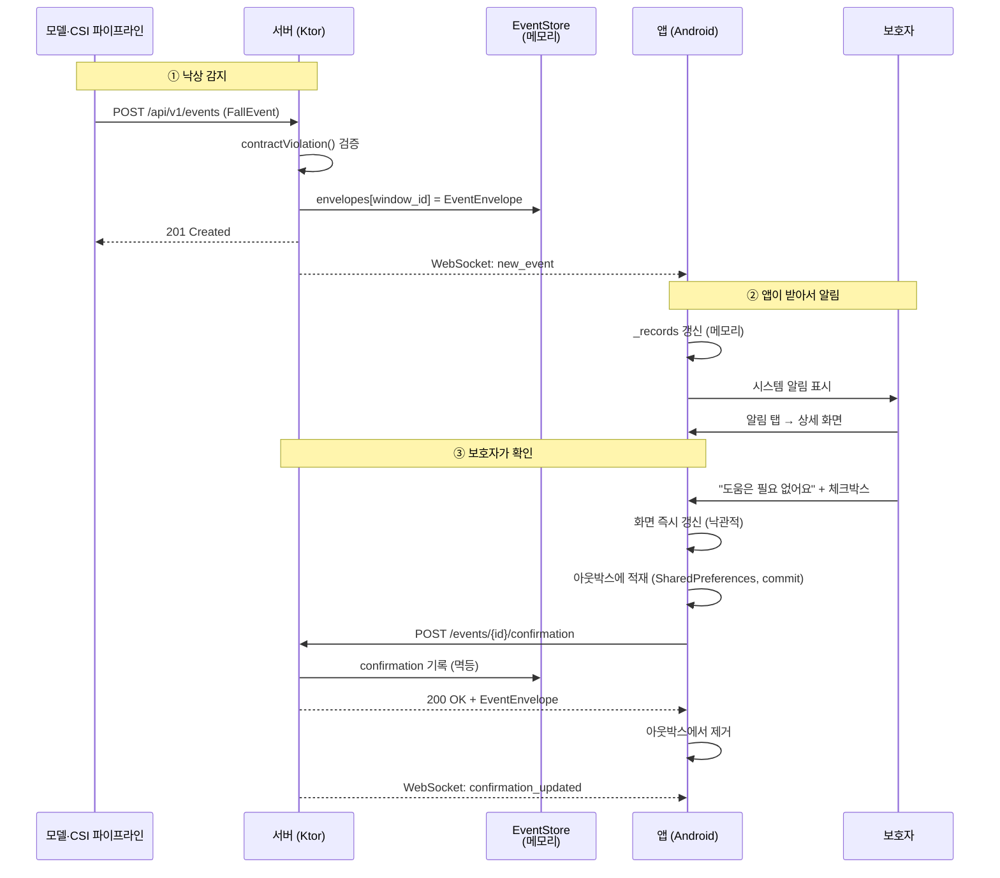

# 데이터 흐름 워크플로우

낙상 알림이 어디서 생겨서 어디로 흐르고, **무엇이 어디에 남는지** 정리한 문서다.
"알림 받으면 DB에 저장되나?"에 대한 답이 3장에 있다.

---

## 1. 한 줄 요약

**DB는 없다.** 서버는 이벤트를 프로세스 메모리에 들고 있고, 앱은 서버를 다시 읽어서
화면을 그린다. 디스크에 남는 건 **아직 서버에 못 보낸 보호자의 확인 결과** 하나뿐이다.

이건 빠뜨린 게 아니라 의도한 선택이다. 저장소·인증 모델이 팀에서 확정되기 전에
스키마를 굳히면 나중에 두 번 만들게 된다
([EventStore.kt](../server/src/main/kotlin/com/carnation/fallalert/server/EventStore.kt) 주석 참고).

---

## 2. 전체 경로

---

## 3. 단계별로 무슨 일이 일어나는가

### ① 이벤트 등록 (서버)

[`Routing.kt`](../server/src/main/kotlin/com/carnation/fallalert/server/Routing.kt) `POST /api/v1/events`

1. `FallEvent` 로 역직렬화
2. `contractViolation()` 검증 — 위반이면 **저장하지 않고** 422.
   잘못된 이벤트가 보호자 화면까지 가면 안 된다
   (예: 타임존 없는 `detected_at` 은 여기서 걸러진다)
3. `EventStore.add()` → `LinkedHashMap<String, EventEnvelope>` 에 `window_id` 키로 넣는다
4. 같은 `window_id` 재전송이면 기존 확인 상태를 **보존한 채** 이벤트만 갱신
5. `MutableSharedFlow` 로 `new_event` 방송 → 붙어 있는 모든 WebSocket 세션으로 나간다

이 시점에 **파일이나 DB에 기록되는 것은 없다.** 서버 프로세스가 죽으면 사라진다.

### ② 앱이 수신

[`FallEventRepository.kt`](../app/src/main/java/com/carnation/fallalert/data/FallEventRepository.kt)

- `EventStreamClient` 가 WebSocket 으로 `new_event` 를 받는다
- 이미 아는 `window_id` 면 알림을 다시 띄우지 않는다 (재전송 중복 방지)
- `_records: MutableStateFlow<List<EventRecord>>` 를 갱신 → Compose 가 다시 그린다
- `newEvents` SharedFlow → ViewModel → `FallAlertNotifier` 가 시스템 알림 표시

**앱은 이벤트 캐시를 남기지 않는다.** 앱을 껐다 켜면 `refresh()` 로 서버에서 전체를
다시 읽는다. 서버가 진실이고 앱은 화면일 뿐이라는 원칙이다.

> ⚠️ 앱이 완전히 종료된 동안 온 이벤트는 못 받는다. WebSocket 은 프로세스가 살아 있을 때만
> 유지된다. 이건 FCM 이 필요한 부분이고 아직 안 붙었다.

### ③ 확인 결과 보고

보호자가 상세 화면에서 버튼을 누르면:

| 순서 | 하는 일 | 어디에 |
|---|---|---|
| 1 | `_records` 즉시 갱신 | 메모리 (낙관적 갱신 — 화면이 먼저 반응해야 한다) |
| 2 | `outbox.enqueue(report)` | **SharedPreferences (`commit()`)** ← 유일하게 디스크에 남는 것 |
| 3 | `POST /events/{id}/confirmation` | 서버 |
| 4 | 성공 시 `outbox.remove()` | 큐에서 삭제 |

전송이 실패하면 큐에 남고, WebSocket 이 다시 붙는 순간 `flushOutbox()` 가 재시도한다.

실패는 두 종류로 나눠 처리한다
([`CarnationApi.kt`](../app/src/main/java/com/carnation/fallalert/data/remote/CarnationApi.kt)):

- **Retryable** (네트워크 끊김, 5xx) → 큐에 남긴다. 뒤 항목도 어차피 실패하므로 그 자리에서 중단
- **Permanent** (404 모르는 window_id, 400) → 큐에서 버린다. 재시도해도 같은 결과라 영원히 남는다

**아웃박스만 디스크에 쓰는 이유:** 보호자가 "도움 필요"를 눌렀는데 하필 그때 네트워크가
끊겼고 앱까지 종료됐다면, 메모리 큐로는 그 의사표시가 그냥 사라진다. 이 앱에서 제일 나쁜
실패다. 그래서 `apply()` 가 아니라 `commit()` 을 쓴다 — 그 줄 다음에 앱이 죽어도 남아야 한다.

### 서버 측 멱등성

`EventStore.confirm()` 은 `window_id` 기준 멱등이다. 앱이 몇 번 재시도해도 결과가 같고,
`confirmedAt` 은 **첫 보고 시각을 유지한다**. 재시도로 30분 늦게 도착해도 보호자가 실제로
누른 시각이 남는다.

---

## 4. 데이터가 사는 곳 (전수)

| 데이터 | 사는 곳 | 재시작하면 | 코드 |
|---|---|---|---|
| 이벤트 목록 | 서버 프로세스 메모리 | **시드 목업으로 돌아감** | `EventStore.envelopes` |
| 확인 상태 | 서버 프로세스 메모리 | **사라짐** | `EventEnvelope.confirmation` |
| 앱의 이벤트 목록 | 앱 메모리 | 서버에서 다시 읽음 | `FallEventRepository._records` |
| **미전송 확인 결과** | **SharedPreferences** | **남음** ✅ | `ConfirmationOutbox` |
| 부모님 정보 | 앱 메모리 | 목업(`ParentProfile.MOCK`)으로 돌아감 | `FallAlertViewModel._parentProfile` |
| 무동작 시간 | **하드코딩 192분** | — | `FallAlertViewModel._inactivityMinutes` |

서버를 재시작하면 `MockEventFactory.seed()` 로 다시 채워진다. 즉 **개발 중에 쌓은 확인
이력은 서버를 끄면 없어진다.** 정상 동작이다.

---

## 5. DB를 붙일 때 손댈 곳

`EventStore` 가 저장소와 맞닿는 **유일한 지점**이다. 라우팅·앱 코드는 건드릴 필요가 없다.

1. `EventStore` 를 인터페이스로 추출 (`all()`, `count()`, `add()`, `confirm()` 4개)
2. `InMemoryEventStore` (지금 것) + `ExposedEventStore` 같은 구현 추가
3. `Main.kt` 의 `module()` 에서 어느 구현을 넣을지 결정
4. `MutableSharedFlow` 방송은 그대로 둔다 — 저장이 끝난 뒤 emit 하는 순서만 지키면 된다

같이 결정해야 하는 것들:

- **보존 기간** — 낙상 이력을 얼마나 남기나. 현관 비밀번호가 얽히면 개인정보 문제가 된다
- **인증** — 지금은 누구나 `POST /events` 를 쏠 수 있다. `clientId` 는 신뢰할 수 없는 값이다
- **페이지네이션** — `GET /events` 가 전체를 반환한다. 이력이 쌓이면 못 버틴다
- **부모님 정보 영구 저장** — DataStore + 암호화 (현관 비밀번호가 들어간다)

---

## 6. 아직 안 된 것

| 항목 | 현재 | 필요한 것 |
|---|---|---|
| 앱 종료 중 알림 | 못 받음 | FCM |
| 이력 영구 보존 | 없음 | DB (5장) |
| 인증 | 없음 | 팀 결정 |
| 무동작 감지 | 하드코딩 | `FallEvent` 계약에 필드가 없다 — 팀이 형식을 정해야 함 |
| 부모님 정보 저장 | 메모리 | DataStore + 암호화 |

관련 문서: [MODEL_TEAM_INTEGRATION.md](MODEL_TEAM_INTEGRATION.md) · [실행방법.md](../실행방법.md)
